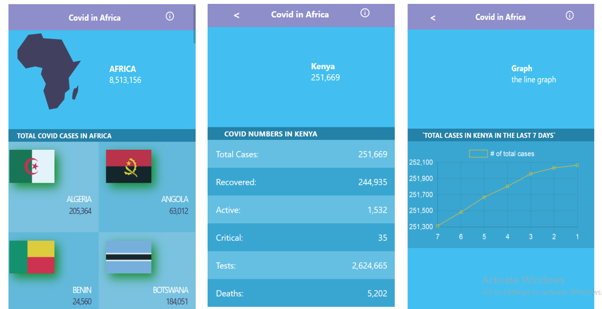

# Covid Tracking in Africa

This is a React and Redux project that shows the updated covid 19 numbers in Africa. It shows the total cases in the entire continent, and more metrics per each country in Africa. It fetches data from the [Diseases.sh API](https://disease.sh/) which is updated on a daily basis. 

## Built With

- React
- Redux
- [Disease.sh API](https://disease.sh/)

## Live
[Live link](https://wonderful-noether-72e742.netlify.app/)

## Getting Started

To get a local copy up and running follow these simple example steps.
- Clone the repository with:
`git clone https://github.com/blakbox23/covid-tracker-ea.git`

- Install dependencies by running:
`npm install`

## Usage
To run the app in your machine, run `npm start`

## Testing
This project tests each component as well as data in the redux store.
To run tests, run `npm test`

## Authors

👤 **Peter Mbuthia**

- GitHub: [@Blakbox23](https://github.com/blakbox23)
- Twitter: [@blakbox23](https://twitter.com/blakbox23)
- LinkedIn: [Peter Mbuthia](https://www.linkedin.com/in/peter-mbuthia)

## 🤝 Contributing

Contributions, issues, and feature requests are welcome!

Feel free to check the [issues page](https://github.com/blakbox23/covid-tracker-ea/issues).

## Show your support

Give a ⭐️ if you like this project!

## Acknowledgments

- [Flat icons](www.flaticon.com)
- [Nelson Sakwa](https://www.behance.net/gallery/31579789/Ballhead-App-(Free-PSDs)) for the design inspirqtion
- Collegues at Microverse

## 📝 License

This project is [MIT](./MIT.md) licensed.
